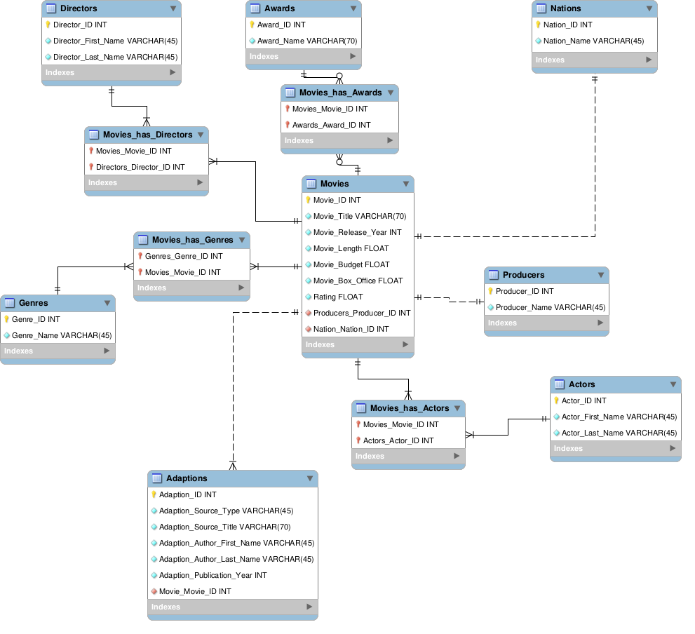

# Rotten-Tomato-Movie-Database

## Introduction
In the era of widespread access to over-the-top (OTT) media services, users are faced with a vast array of movie options, making choosing a suitable movie a common task. This project aims to build a database that collects the basic information of existing movies, focusing on attributes such as the cast, director, and rating. The main target audience includes movie enthusiasts, casual viewers, and film bloggers/influencers.

The database provides easy access to comprehensive movie information, enabling users to quickly find essential details about a movie and compare various aspects of different movies in one place. This enhances decision-making and provides detailed information about the original works from which the movies are adapted and their authors, appealing to users interested in adaptations.

## Database Design and Implementation

### Logical Design
The Entity-Relationship Diagram (ERD) demonstrates the logical design of the database.
 

### Physical Database
The physical database is structured according to the corresponding SQL script provided.

### Sample Data
30 randomly selected movies are collected as the sample data, primarily retrieved from Rotten Tomatoes, supplemented with fields such as budget and box office earnings collected manually.

### Queries
Five views are created covering genres, adaptations, movie length, etc. The views are as follows:
- `generes_box_office`
- `country_most_adpations`
- `average_movie_length_us`
- `adapted_movie_ratings`
- `most_common_genre_post2000`

