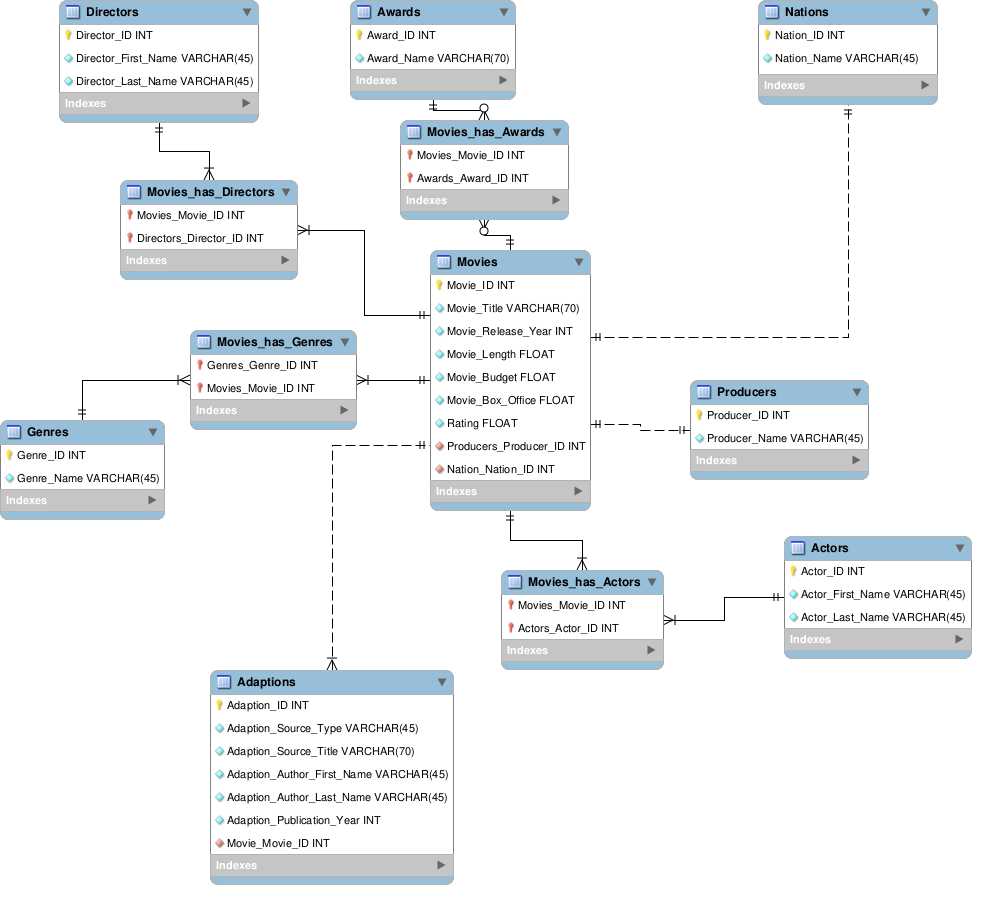

# 🍅 Rotten Tomato Movie Database

A relational database project that models and queries movie, critic, and adaptation data, inspired by Rotten Tomatoes. The project is designed to provide structured insights into film data such as cast, director, genres, and adaptations through normalized schemas and SQL queries.

---

## 🎯 Project Overview

As streaming platforms expand, viewers are overwhelmed with choices. This project helps simplify decision-making by offering a cleanly structured relational database of movie information. Key features include:

- Access to detailed metadata (cast, director, country, rating)
- Exploration of film adaptations and their sources
- Analytical views on genres, length, ratings, and box office performance

---

## 🧩 Database Design

### 🔷 Entity-Relationship Diagram

The ERD models entities such as movies, people (actors, directors), genres, and source material:

### 📐 MySQL Workbench Model

Design files can be explored directly via the included MySQL Workbench file:

> **File:** `db_ERD.mwb`

---

## 🗃️ Implementation & Sample Data

The database was created using a single SQL script:

> **File:** `db_scirpit_with_views.sql`

- Includes table creation (DDL), data insertion, and SQL views
- Sample data includes 30 movies sourced from Rotten Tomatoes
- Additional fields (e.g., budget, box office) were manually curated

---

## 🔍 Key SQL Views

The script includes several analytical views:

| View Name | Description |
|-----------|-------------|
| `genres_box_office` | Compare box office earnings by genre |
| `country_most_adaptations` | Find countries with the most film adaptations |
| `average_movie_length_us` | Analyze average runtime of U.S. films |
| `adapted_movie_ratings` | Compare ratings of adapted vs. original films |
| `most_common_genre_post2000` | Most frequent genres after 2000 |

---

## 🛠️ Technologies Used

- **MySQL**
- **MySQL Workbench**
- **SQL Views**
- **ER Modeling**

---

## 💡 Key Learning Outcomes

- Built and normalized relational schemas (1NF–3NF)
- Created and optimized SQL views for film data analytics
- Applied ER modeling for real-world database structuring
- Practiced integrity constraints and efficient querying

---

## 📌 Author

Claire Liu – Graduate Student @ Northeastern University  
[GitHub](https://github.com/happy1claire)
